# Documentation
## General
### Project Startup
During the program startup, the user chooses
between importing an H5 file, creating a new or loading an existing project. All necessary information is stored in a project folder, the default location is `USERHOME\GIWAXSProjects\`

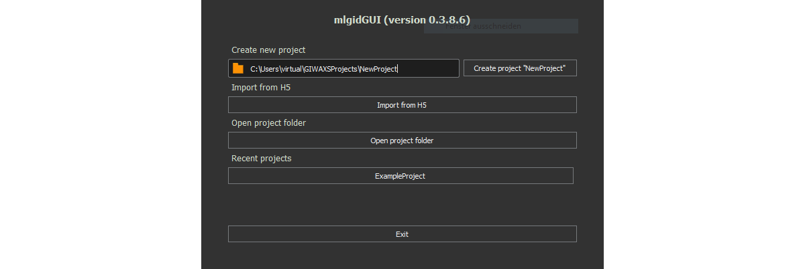


### Project Folder

mlgidGUI uses project folders to store the current progress. The project files are stored as pickle binaries to facilitate
faster serialization and deserialization, reducing disk I/O overhead. However, they are not intended for sharing or 
copying to other machines due to potential incompatibilities arising from the use of pickle. Projects can be shared via 
HDF5 files (see below).

A project folder contains the following data:

  The `project_structure` file contains the pickled `ProjectStructure` Python-object which holds the project folder path and the configuration.

Subfolders:

- `CIF_files` : Contains the CIF files used for the simulation.
- `geometries` : Contains the pickled `Geometry` object for each image. The object saves e.g. the beam center position.
- `images` : Contains the original images in reciprocal space.
- `roi_data` : Contains the labeled ROIs and the fits.
- `radial_profiles` : Contains information from the 'Radial Profile' Widget, e.g. the smoothed radial profile.
- `rois_meta_data` : Contains information about locations of the images.


### HDF5 file structure

mlgidGUI supports the import and export of HDF5-files with the following structure:

````
export.H5
    |--- foldername
        |--- imagename
            |--- image
            |--- polar_image
            |--- roi_data
                |--- angle
                |--- angle_std
                |--- cif_file
                |--- confidence_level
                |--- key
                |--- radius
                |--- width
                |--- type
````
The ``image`` array in the HDF5-file contains the image in the original format, meaning it is stored the way it was imported 
to the GUI, without geometry- or contrast corrections. The ``polar_image`` array contains the image in polar coordinates
without contrast corrections. The ``roi_data`` folder contains the data of the labeled peaks and rings. The ``angle`` array 
gives the angle in degrees, the ``angle_std`` contains half of the azimuthal length in degrees. The ``radius`` and ``width`` arrays are 
given in pixels. The following graphic illustrates the variables:


The ``cif_file`` array contains a string with the name of the cif file corresponding to each peak. The ``key`` array 
contains a unique number for each labeled peak or ring. The ``type`` array has the three different values
````
ring = 1
segment = 2
background = 3
````
 for each labeled peak (segment) or ring. Background artifacts get the value 3. The ``confidence_level`` array contains
 the following values: 
````
High = 1
Medium = 0.5
Low = 0.1
Not set = -1
````
for each labeled peak or ring. These three different confidence values allow to evaluate a ML model separately on different
confidence levels.

### Data Export
The current progress is saved in a project folder at the user's home directory when closing the window.
Additionally, the project can be exported to an H5 file or the VOC dataset format for ML-based object detection. The 
export is available by clicking `File` -> `Save Project`. The standard setting is the export to H5. The user can select 
if only one image or the whole project is exported.

### Widgets
The interface of mlgidGUI is built up of five different widgets. We arranged four widgets, in a way that we find
useful for efficient annotation. To provide the maximum flexibility to the user, each widget can be detached from the 
main window by a double click on the blue bar of each widget. Additionally, moving a widget inside the main window is 
possible by a drag and drop of the blue bar.

## Project Manager
The project manager is the central widget to display the files, the labeled peaks and to control the CIF file simulation.

The `Files` tab shows all files and folders added to the project. Clicking on an image file in the `Files` tab selects it also for the
other widgets.

### Labeled ROIs

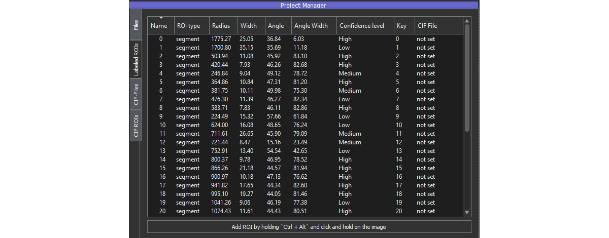

Annotations can be added to the image using the shortcut `Add ROI` by holding `Ctrl + Alt` and a click and hold with the 
mouse on the image. The key combination `Ctrl + H` can be used to hide the annotations.

The `Labeled ROIs` tab shows the annotations added to the currently selected image:

- `ROI type`: Either ring or segment: A ring spreads in the azimuthal direction over 90 degrees, a segment spreads over a smaller area.
- `Radius`: The center of the ring or segment in radial direction. [pixels]
- `Width`: The area in the radial direction covered by a segment or ring. [pixels]
- `Angle`: The center of the ring or segment in azimuthal direction. [degrees]
- `Angle Width`: The area in azimuthal direction covered by a segment or ring. (2*angle_std) [degrees]
- `Confidence level`: The probability of a human to detect this Bragg peak. [high, medium, low]
- `CIF File`: The CIF file of the structure, to which the peak belongs to.

### CIF Files & CIF ROIs

mlgidGUI has an integrated simulation of GIWAXS patterns from [CIF files](https://en.wikipedia.org/wiki/Crystallographic_Information_File)
based on the package [xrayutilities](https://github.com/dkriegner/xrayutilities). It can simulate scattering patterns from 
powder diffraction or single crystals.

CIF files can be added through the toolbar by clicking `Data` -> `Add CIF File` 


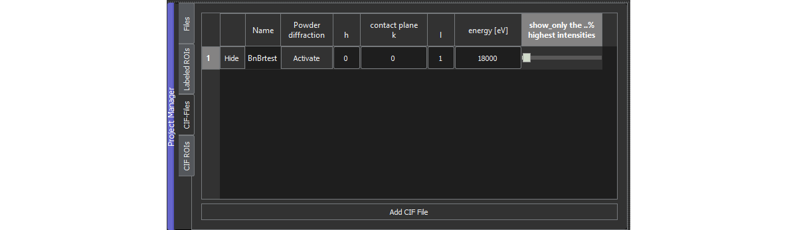

The relevant settings for simulated GIWAXS patterns are:

- The described structure in the imported CIF file
- Powder diffraction [activated/deactivated]
- Contact plane [hkl] (used in case of deactivated powder diffraction)
- % of peaks to show (from highest to lowest intensity). Moving the slider to the right hides less intense peaks.
- The Q-range (can be set in the Image Viewer widget)
- The beam center (can be set in the Image Viewer widget)

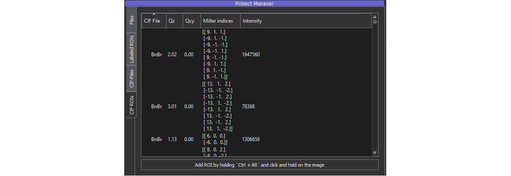

The tab `CIF ROIs` shows the properties `CIF File`, `Qz`, `Qxy`, `Miller indices`
and `intensity` of each simulated peak and ring. The table allows the sorting by each property.

## Angular Profile
The Angular Profile widget shows the mean azimuthal profile along the radius of a labeled peak. The extent of a labeled ring or peak can be 
changed by clicking and holding the edge of the purple area. Simultaneously, the labeled peak in the other widgets is changed.

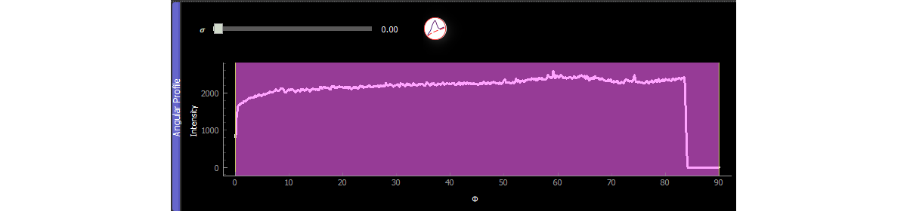

The sigma slider allows to adjust the sigma value of the Gaussian filter. Higher values result in a smoother azimuthal profile.
Please note, that the smoothing is only used for visualization purposes. It does not affect the underlying data for the fitting.

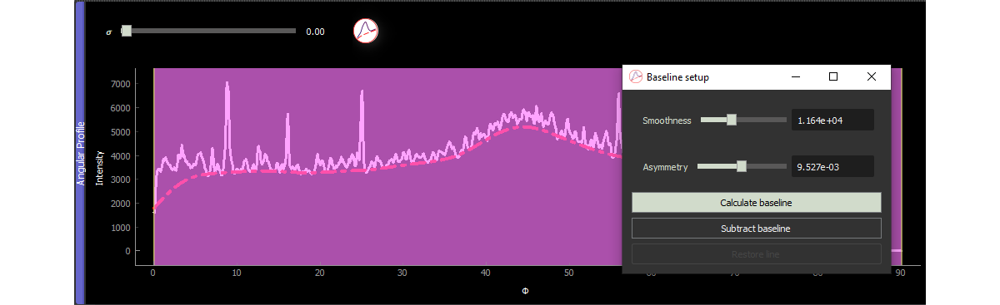

The baseline can be used to estimate the azimuthal shape of the ring/peak. Subtracting the line helps to identify peaks
on top of a ring.

## Image Viewer
The Image Viewer shows the imported image in reciprocal space, the labeled rings and segments (Labeled ROIs) and the 
simulated GIWAXS patterns (CIF ROIs).

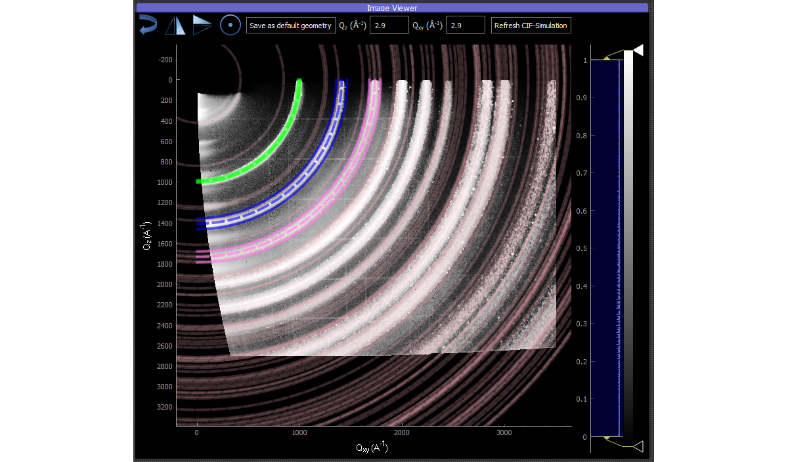

The colors have the following meaning:

- Green: Fitted annotation
- Blue: Not yet fitted annotation
- Pink: Currently selected annotation
- Transparent pink rings: Result of the simulation

### Contrast correction
Some Bragg peaks on diffraction images can have a low signal to noise ratio, therefore contrast corrections are crucial.
mlgidGUI uses a [CLAHE](https://docs.opencv.org/4.x/d5/daf/tutorial_py_histogram_equalization.html)-based contrast correction by default. Nevertheless, custom contrast settings may be 
needed and can be activated by a right click on the histogram bar ('Disable CLAHE'). After disabling CLAHE, the contrast
limits can be adjusted by dragging the yellow arrow on the top and bottom. To identify peaks with a low brightness, it 
can be helpful to use a custom colourmap. This feature can be activated by a right click on the colourband beside the 
histogram.

### Toolbar

The toolbar has multiple buttons to align the beam center in the top left and to set the correct Q-range for the simulation.
The buttons allow to flip the image both vertically and horizontally or rotate the image by 90 degrees. The ``Save as default geometry`` 
button allows to save the geometry settings and use it for the other images in the project.

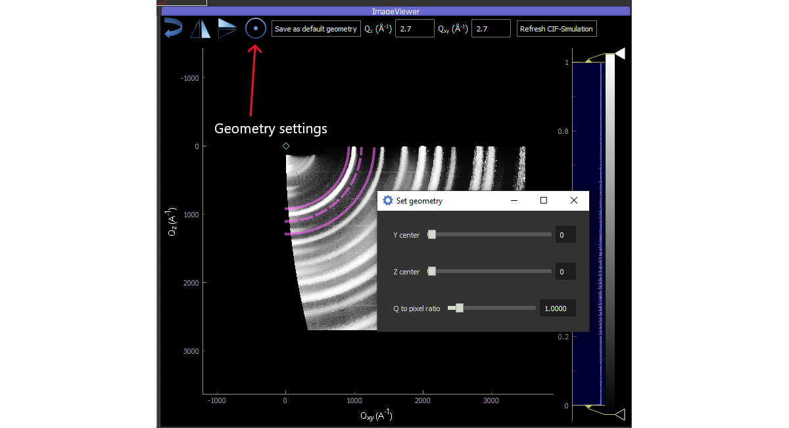

## Radial Fit
The Radial Fit widget is used for fitting a Gaussian curve on top of a linear background in the radial direction. The white
line shows the radial profile, the red Gaussian bell is the fitted Gaussian function, the blue line shows the fitted background. 

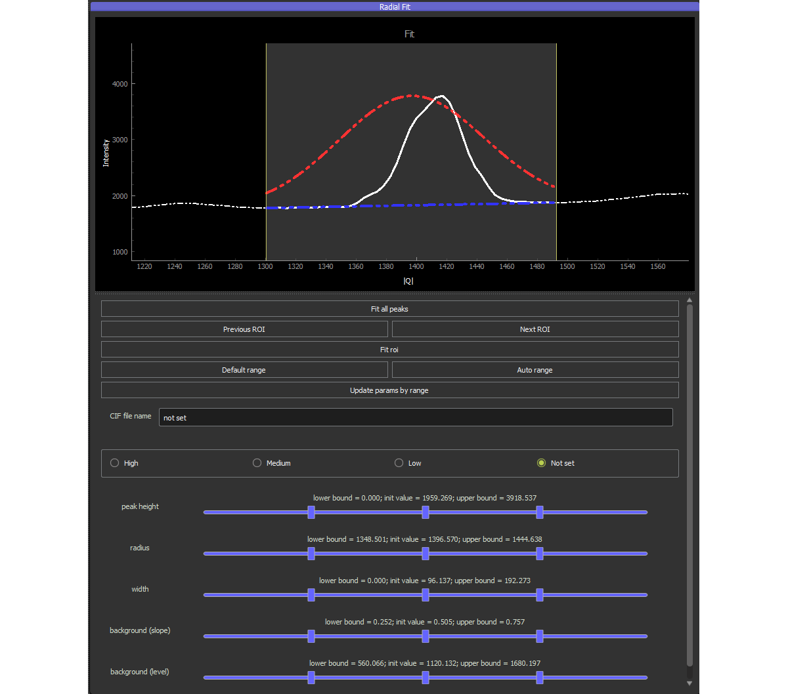

The underlying fitting uses a Gaussian function on top of a linear background:

${\displaystyle f(x)=ax + b+ A\exp \left(-{\frac {(x-\mu)^{2}}{2\sigma^{2}}}\right)}$

The fitting uses the ``curve_fit`` function of scipy, which performs a non-linear least squares fit. The user selects 
the bounds in the radial direction for the fitting, they are displayed as yellow lines to the left and right of the 
selected ROI.


The buttons have the following meaning:

- ``Fit all peaks``: Fits all peaks in the current image. This can alter already fitted peaks, therefore use it with caution.
- ``Previous ROI``: Switches to a ROI with a lower radius.
- ``Next ROI``: Switches to a ROI with a higher radius.
- ``Fit ROI``: Uses the selected boundaries (yellow) and performs the fit.
- ``Default range``: Adjusts the range to the boundaries which the user initially selected with the mouse on the image.
- ``Auto range``: Attempts to find optimal boundaries. Helpful for most of the peaks, but the user should still verify them.
- ``Update params by range``: Adjusts the graph and the fitting parameters to the currently selected bounds. The selected
peak is placed in the center of the graph.
- ``CIF file name``: Name of the structure the peak belongs to.
- ``Confidence level radio buttons``: [High, Medium, Low] Sets the confidence of a peak.

The sliders expose all variables used for the fitting and are needed for complex shapes or when the fit has failed.
While the sliders in the middle are used as inital parameters for the fitting, the sliders on the side allow to control 
the boundaries of the fitting function. These sliders are only needed for complex cases, we discovered that most ROIs can
be fitted without manually changing the sliders.

## Radial Profile
The ``Radial Profile`` widget shows the full radial profile of the reciprocal image:

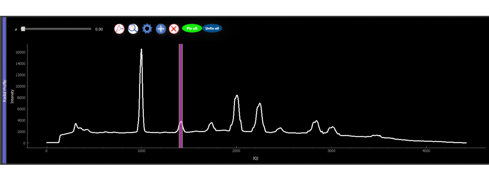

The sigma slider on the top left allows to adjust the sigma value of the Gaussian smoothing. Higher values result in a 
smoother radial profile. Please note, that the smoothing is only used for visualization purposes. It does not affect the
underlying data for the fitting. The baseline can be subtracted from the profile and helps to identify Bragg peaks. The 
`find peaks` button uses the scipy function `find_peaks`, the settings button can be used to adjust the fitting parameters.
The ``plus button`` allows to add a peak, the ``X-button`` allows to delete a peak. Fix all and unfix all will block or
unblock the modification of a fitted peak.


## Polar Image

The Polar Image widget shows the result of the conversion to polar coordinates. 

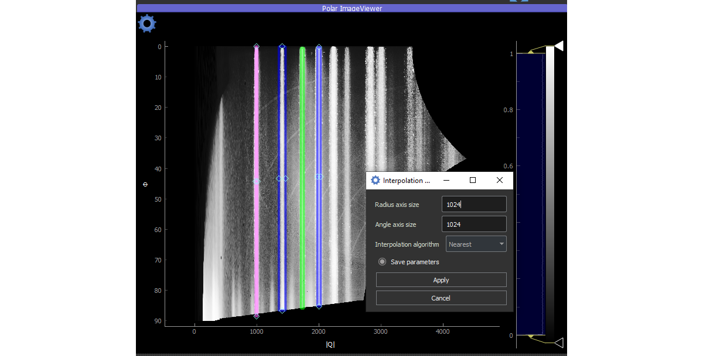

The interpolation settings allow to control the resolution and interpolation algorithm to which the image is converted to.
The result of the interpolation is used for the fitting. Therefore a higher resolution leads to more accurate fits.
Nevertheless, it is unnecessary to adjust the polar image 
resolution beyond that of the reciprocal image, as the missing pixels will  be interpolated.


## Miscellaneous

### Earlier versions

Earlier versions of this project are available at [https://github.com/StarostinV/GIWAXS_GUI](https://github.com/StarostinV/GIWAXS_GUI)
and [https://github.com/StarostinV/GIWAXS_GUI_2](https://github.com/StarostinV/GIWAXS_GUI_2)

### API
Currently, mlgidGUI does not offer an API, but is intended to be used by the GUI.

### Tests

Testing of mlgidGUI can be done with the command `pytest ./tests.` During deployment, tests are automatically run by
Github actions in the step `Test with pytest` as part of the job `test_and_win_exe`.

### Community guidelines

Community guidelines are written down in the CONTRIBUTING.md file in the root folder.

### Code of conduct

Community guidelines are written down in the CODE_OF_CONDUCT.md file in the root folder.
