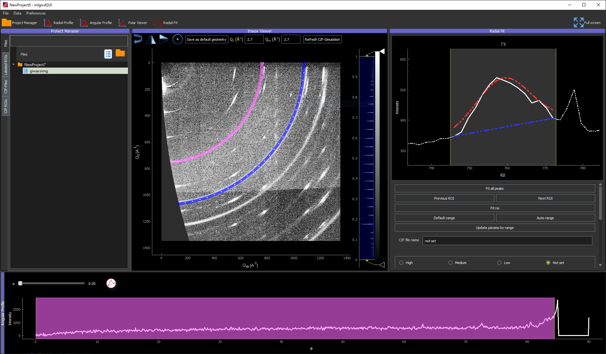
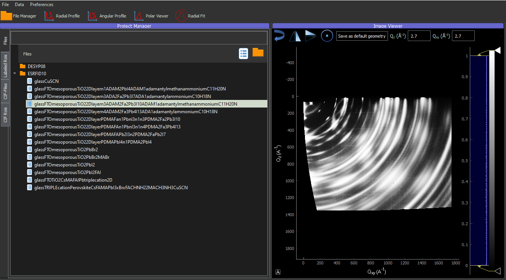
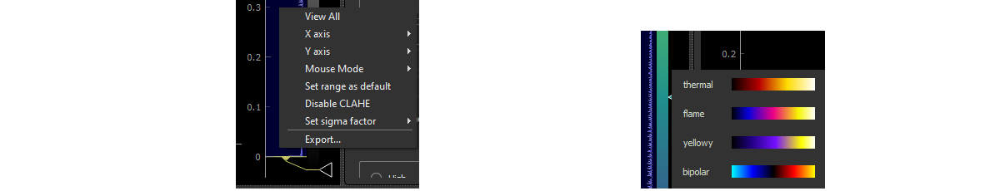
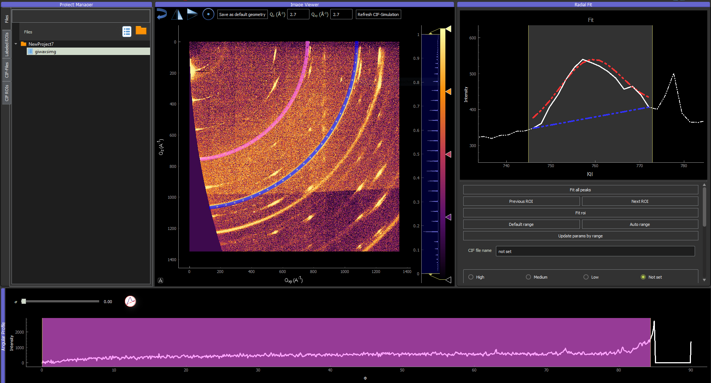
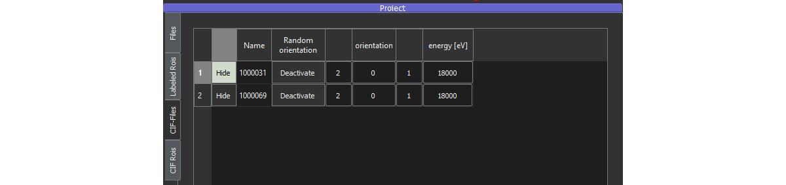

# Workflow

## Overview

The program provides different tools for visualizing, detecting and fitting 
Bragg reflections with radial symmetry on diffraction images. 
The corresponding angular and radial positions and sizes of 
detected diffraction reflections can be saved
for further analysis.

The graphical interface consists of several functional widgets that can be dragged 
over the window,
resized and hidden to optimize the analysis. One can show/hide widgets by clicking on the corresponding 
icons on the top left toolbar. The widgets are:

* Project manager (top left)
* Image viewer (top center)
* Angular profile (bottom)
* Radial fit (top right)
* Radial profile (not shown)

## Project

The project widget shows all files and folders which are part of the project. There are three more tabs:
One shows the current annotations ('Labeled ROIs'), the CIF files used for the simulated Bragg peaks are shown in  ('CIF-Files')
, whereas the result of the simulation is shown in ('CIF ROIs').

### Available input formats

We added a CIF file, a GIWAXS image, and an HDF5 file in the `docs\example_files` folder to provide the user with examples.

GIWAXS data can be imported from the following file types:

* .tif(f)
* .edf
* .h5 (unlabeled images or import from a ML-Model)
* folder containing images

An image can be added through the toolbar:

## Geometry corrections

After importing an image, please ensure that the beam center is correctly positioned in the top left corner.
In case the beam center is not perfectly aligned with the image, the beam center button allows to adjust the position.
The buttons allow to flip the image such that the beam center is on the top left.

## Contrast correction

Some Bragg peaks on diffraction images can have a low signal to noise ratio, therefore contrast corrections are crucial.
mlgidGUI uses a CLAHE-based contrast correction by default. Nevertheless, custom contrast 
settings may be needed and can be activated by a right click on the histogram bar ('Disable CLAHE'). After disabling CLAHE, the contrast 
limits can be adjusted by dragging the yellow arrow on the top and bottom. To identify peaks with a low brightness, 
it can be helpful to use a custom colourmap. This feature can be activated by a right click on the colourband beside the 
histogram.

### Annotations

Annotations can be added with the key combination `Ctrl + Alt` and a mouseclick- and hold on the image. 
The ('Radial Fit') now shows the radial - and the ('Angular Profile') the angular profile. These widgets allow to precisely
adjust the borders to the diffraction patterns. Additionally, the ('Radial Fit') widget allows to perform a Gaussian fit in 
the radial direction.

## Crystallographic toolkit

mlgidGUI allows to simulate GIWAXS patterns from CIF files for the following purposes:

- In case the structure and contact plane is known, it supports the user by highlighting the expected peak positions.
- If only the structure is known, the simulation allows to identify the contact plane by comparing simulated peak positions
with the experimental diffraction patterns.

CIF files can be added through the toolbar:

After the import, the simulation automatically calculates rings for powder diffraction. The file now
appears in the CIF-Files tab of the project manager. The user can change the angle of incidence and set a custom contact plane. 

## Data Export

The current progress is saved in a project folder at the user's home directory. Additionally, the data can be exported as an H5 file.
An export in the Pascal-VOC format allows the user to use the dataset for ML-based object detection.
